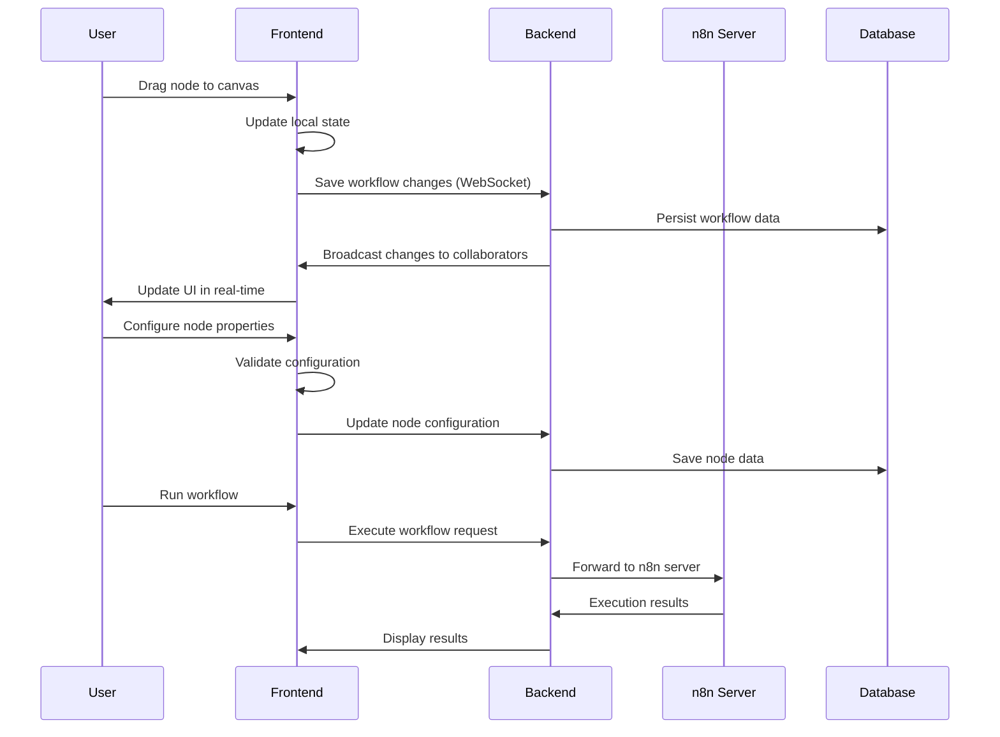
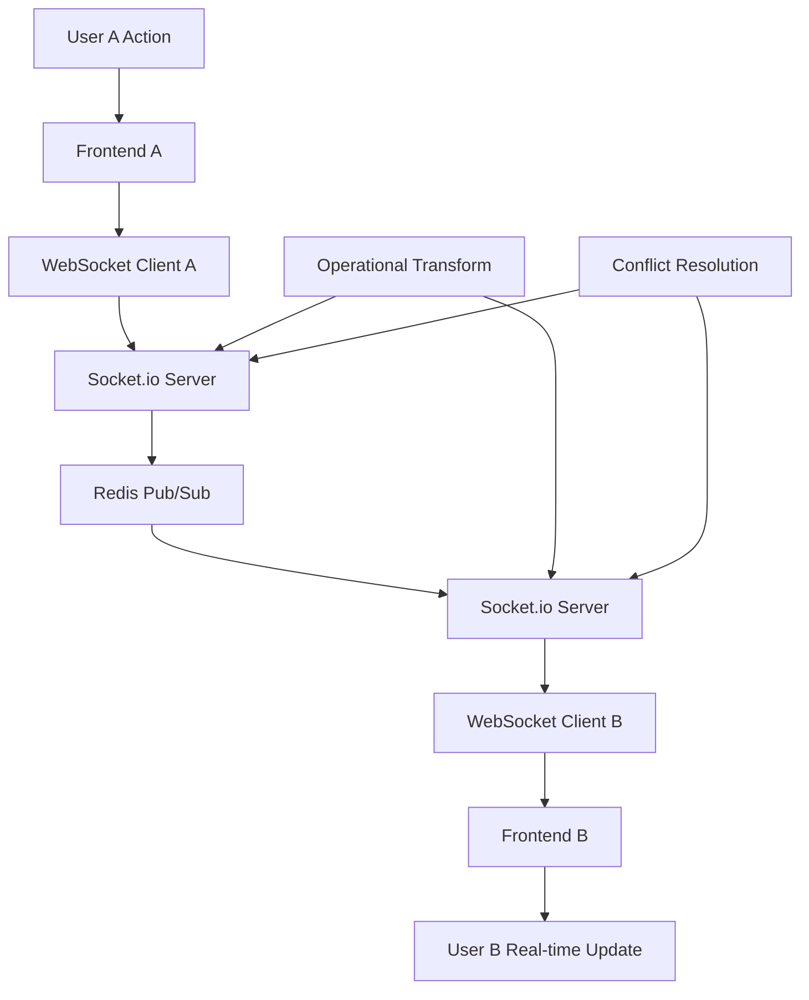
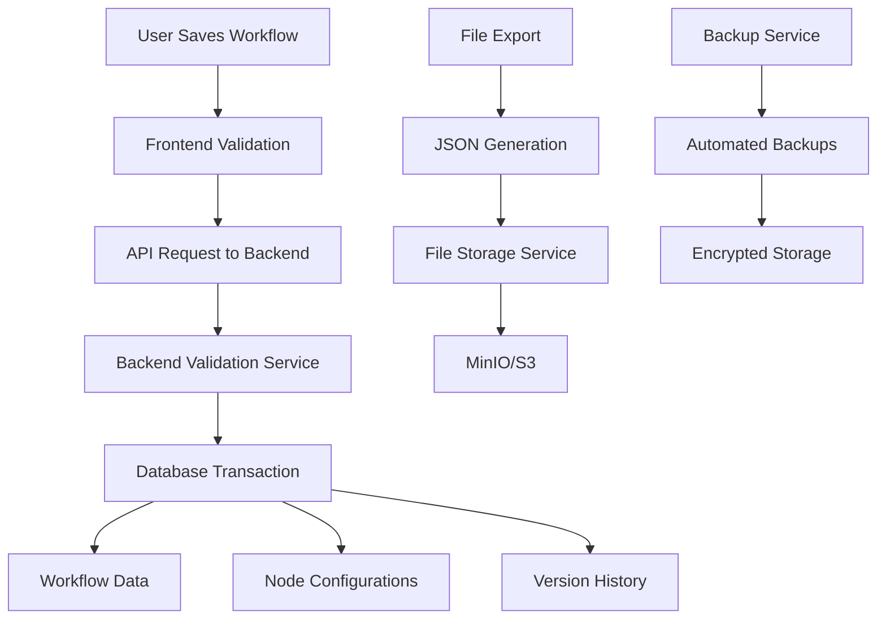
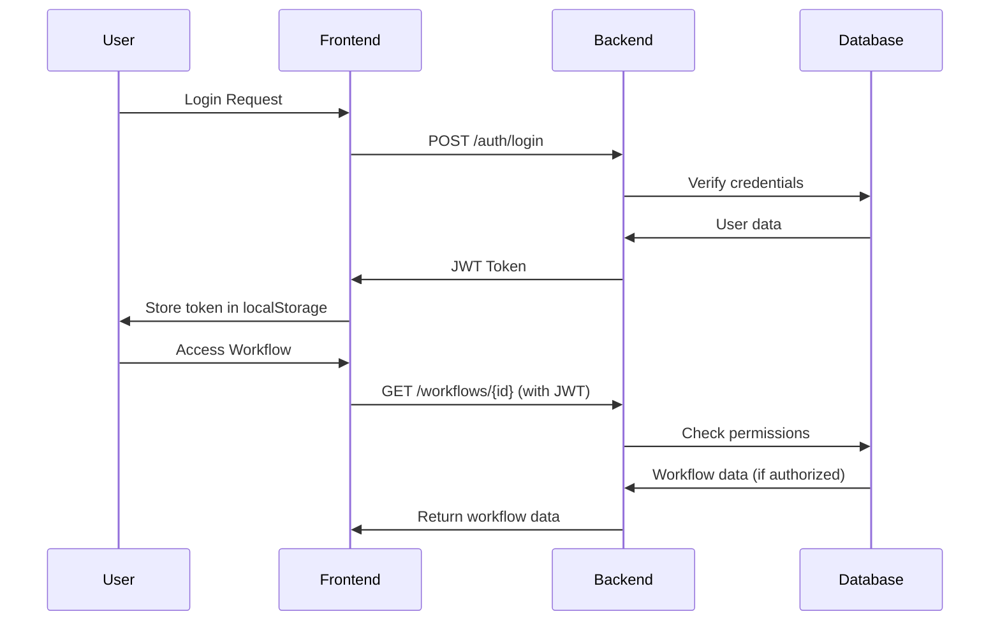

# n8n Visual Workflow Builder - System Architecture

## Overview

This document outlines the comprehensive system architecture for the n8n Visual Workflow Builder, a modern no-code automation platform that provides an intuitive drag-and-drop interface for creating, editing, and managing n8n workflows.

## 1. System Components

### 1.1 Frontend Application (Client Layer)

**Workflow Builder UI**
- **Technology**: React 18 + TypeScript
- **Canvas Engine**: ReactFlow for drag-and-drop workflow creation
- **Styling**: Tailwind CSS with responsive design
- **State Management**: Zustand for client-side state
- **Real-time Features**: Socket.io client for collaborative editing

**Key Components:**
- **Canvas Component**: Main workflow editing area with zoom, pan, and node manipulation
- **Node Palette**: Categorized node library (Triggers, Actions, Logic, Data Transform, AI)
- **Properties Panel**: Context-sensitive node configuration interface
- **Toolbar**: Workflow operations (save, export, run, debug)
- **Validation Engine**: Real-time workflow validation and error reporting

**Responsibilities:**
- Provide intuitive visual workflow creation interface
- Handle real-time collaboration between multiple users
- Manage local workflow state and synchronization
- Perform client-side validation and error handling

### 1.2 Backend Services (Server Layer)

**Workflow Management Service**
- **Technology**: Node.js with TypeScript
- **Framework**: Express.js or Fastify
- **Database**: PostgreSQL for workflow metadata and user management
- **Cache**: Redis for session management and real-time features
- **File Storage**: MinIO or AWS S3 for workflow exports and templates

**API Gateway**
- **Technology**: Node.js with TypeScript
- **Framework**: Express.js with middleware
- **Authentication**: JWT tokens with OAuth2 integration
- **Rate Limiting**: Redis-based rate limiting
- **CORS**: Configurable CORS policies

**Real-time Service**
- **Technology**: Socket.io server
- **Purpose**: Enable real-time collaboration and live updates
- **Features**: Operational Transform for conflict resolution
- **Scaling**: Redis adapter for horizontal scaling

**Validation Service**
- **Technology**: Node.js microservice
- **Purpose**: Perform complex workflow validation
- **Features**: Syntax validation, type checking, circular dependency detection
- **Performance**: Async processing with queuing

### 1.3 External Integrations

**n8n Server Integration**
- **Protocol**: REST API and WebSocket
- **Authentication**: API keys and OAuth2
- **Features**: Workflow execution, credential management, webhook handling
- **Versioning**: Support for multiple n8n versions

**AI Services**
- **OpenAI Integration**: GPT models for workflow generation and assistance
- **Anthropic Integration**: Claude models for advanced reasoning
- **Hugging Face**: ML model inference for data processing
- **Vector Databases**: Pinecone/Weaviate for similarity search

**External APIs**
- **Email Services**: SendGrid, Mailgun for email operations
- **Cloud Storage**: AWS S3, Google Cloud Storage for file operations
- **Message Queues**: RabbitMQ, Apache Kafka for async processing
- **Databases**: MongoDB, PostgreSQL connectors

### 1.4 Data Storage Layer

**Primary Database (PostgreSQL)**
```sql
-- Users and authentication
users (id, email, password_hash, created_at, updated_at)
user_sessions (id, user_id, token, expires_at)

-- Workflow metadata
workflows (id, name, description, user_id, version, created_at, updated_at)
workflow_versions (id, workflow_id, version_number, data, created_at)

-- Node templates and configurations
node_templates (id, name, category, type, configuration_schema, created_at)
workflow_nodes (id, workflow_id, node_id, position_x, position_y, configuration)

-- Collaboration and sharing
workflow_shares (id, workflow_id, user_id, permission_level, created_at)
```

**Cache Layer (Redis)**
- **Session Storage**: User authentication and real-time collaboration sessions
- **Workflow Cache**: Frequently accessed workflow data
- **Rate Limiting**: API rate limiting counters
- **Pub/Sub**: Real-time event broadcasting

**File Storage**
- **Workflow Exports**: JSON files for n8n compatibility
- **Template Library**: Shared workflow templates
- **User Uploads**: File nodes and data imports
- **Backup Storage**: Automated backups and disaster recovery

## 2. Communication Flow

### 2.1 User Interaction Flow



### 2.2 Real-time Collaboration Flow



### 2.3 Data Persistence Flow



### 2.4 Authentication and Authorization Flow



## 3. Technology Stack

### 3.1 Runtime and Language

**Frontend Runtime:**
- **Node.js 18+**: JavaScript runtime for build tools and development server
- **V8 Engine**: High-performance JavaScript engine
- **Vite**: Fast build tool and development server
- **ES2022+**: Modern JavaScript features with TypeScript compilation

**Backend Runtime:**
- **Node.js 18+**: Server-side JavaScript runtime
- **TypeScript**: Type-safe JavaScript development
- **Express.js/Fastify**: Web framework for API development
- **Socket.io**: Real-time communication library

**Languages:**
- **TypeScript**: Primary development language for type safety
- **JavaScript (ES2022)**: Runtime language after compilation
- **SQL**: Database query language for PostgreSQL
- **JSON**: Data interchange format for workflows and APIs

### 3.2 Infrastructure Components

**Compute:**
- **Application Servers**: Node.js processes running the backend services
- **Web Servers**: Nginx for static file serving and reverse proxy
- **Load Balancers**: HAProxy or AWS ALB for traffic distribution
- **Container Runtime**: Docker for containerized deployments

**Storage:**
- **Relational Database**: PostgreSQL for structured data
- **Cache**: Redis for high-performance data caching
- **File Storage**: MinIO (S3-compatible) for object storage
- **Search Engine**: Elasticsearch for workflow and template search

**Networking:**
- **CDN**: CloudFlare or AWS CloudFront for global content delivery
- **DNS**: Route53 or CloudFlare for domain management
- **Firewall**: AWS Security Groups or iptables for network security
- **VPN**: OpenVPN or WireGuard for secure internal communication

**Monitoring and Observability:**
- **Logging**: Winston (Node.js) + ELK Stack (Elasticsearch, Logstash, Kibana)
- **Metrics**: Prometheus with Grafana dashboards
- **Tracing**: Jaeger for distributed tracing
- **Error Tracking**: Sentry for error monitoring and reporting

## 4. Deployment Model

### 4.1 Development Environment

**Local Development Setup:**
```bash
# Frontend Development
cd workflow-builder/
npm run dev  # Runs on http://localhost:3000

# Backend Development
cd workflow-builder-server/
npm run dev  # Runs on http://localhost:3001

# Database
docker run -d -p 5432:5432 postgres:15
redis docker run -d -p 6379:6379 redis:7

# Services run independently for development
```

**Development Infrastructure:**
- **Containerization**: Docker Compose for local service orchestration
- **Hot Reloading**: Vite for frontend, Nodemon for backend
- **Debugging**: Chrome DevTools, VS Code Debugger
- **Testing**: Jest for unit tests, Cypress for E2E tests

### 4.2 Staging Environment

**Pre-production Testing:**
- **Infrastructure**: AWS ECS Fargate or Google Cloud Run
- **Database**: RDS PostgreSQL with read replicas
- **Cache**: ElastiCache Redis cluster
- **Monitoring**: DataDog or New Relic for application monitoring
- **CDN**: CloudFlare for static asset delivery

**Deployment Pipeline:**
```yaml
# GitHub Actions Workflow
name: Deploy to Staging
on:
  push:
    branches: [develop]

jobs:
  deploy:
    runs-on: ubuntu-latest
    steps:
      - uses: actions/checkout@v3
      - uses: docker/setup-buildx-action@v2
      - name: Build and push Docker images
        run: |
          docker build -t workflow-builder-frontend:${{ github.sha }} ./workflow-builder
          docker build -t workflow-builder-backend:${{ github.sha }} ./workflow-builder-server
      - name: Deploy to AWS ECS
        run: |
          aws ecs update-service --cluster staging --service workflow-builder
```

### 4.3 Production Environment

**High Availability Production Setup:**

**Multi-Region Architecture:**
```
Global Load Balancer (CloudFlare)
    ├── US-East-1 (Primary)
    │   ├── ECS Cluster (3 tasks)
    │   │   ├── Frontend Service (ALB)
    │   │   ├── Backend Service (ALB)
    │   │   └── Real-time Service (ALB)
    │   ├── RDS PostgreSQL (Multi-AZ)
    │   ├── ElastiCache Redis (Cluster)
    │   └── S3 Bucket (Versioned)
    │
    └── EU-West-1 (Secondary)
        ├── ECS Cluster (2 tasks)
        ├── RDS PostgreSQL (Read Replica)
        └── ElastiCache Redis (Replica)
```

**Production Infrastructure:**
- **Container Orchestration**: Amazon ECS with Fargate
- **Auto Scaling**: CPU and memory-based scaling policies
- **Database**: Aurora PostgreSQL with read replicas
- **Global Distribution**: CloudFlare CDN with geo-routing
- **Backup Strategy**: Automated daily backups with cross-region replication

**Security Measures:**
- **Network Security**: VPC with private subnets, security groups
- **Data Encryption**: AES-256 encryption at rest, TLS 1.3 in transit
- **Access Control**: IAM roles with least privilege principle
- **DDoS Protection**: CloudFlare WAF and rate limiting

### 4.4 Disaster Recovery

**Backup and Recovery Strategy:**
- **Database Backups**: Automated PostgreSQL backups every 6 hours
- **File Backups**: S3 cross-region replication
- **Configuration Backup**: Git-based configuration management
- **Recovery Testing**: Quarterly disaster recovery drills

**High Availability Features:**
- **Multi-AZ Deployment**: Database and cache across availability zones
- **Auto-healing**: ECS service auto-recovery
- **Circuit Breakers**: API gateway failure detection
- **Graceful Degradation**: Service degradation with fallback options

## 5. Scalability and Security TODOs

### 5.1 Scalability Enhancements

**Immediate (0-3 months):**

- [ ] **Horizontal Pod Scaling**: Implement HPA for ECS services based on CPU/memory metrics
- [ ] **Database Read Replicas**: Add read replicas for read-heavy operations
- [ ] **CDN Optimization**: Implement cache headers and edge caching for static assets
- [ ] **API Response Caching**: Add Redis caching for frequently accessed workflow data
- [ ] **Background Job Processing**: Implement job queues for heavy operations (workflow validation, exports)

**Medium-term (3-6 months):**

- [ ] **Microservices Architecture**: Split monolithic backend into workflow-service, auth-service, validation-service
- [ ] **Event-driven Architecture**: Implement event sourcing for workflow changes and real-time updates
- [ ] **Global Database Replication**: Multi-region database replication for global users
- [ ] **Edge Computing**: Deploy lightweight workflow validation to edge locations
- [ ] **Advanced Caching Strategy**: Implement multi-level caching (browser → CDN → Redis → Database)

**Long-term (6-12 months):**

- [ ] **Serverless Functions**: Migrate suitable services to Lambda/Cloud Functions for cost optimization
- [ ] **Machine Learning Optimization**: Use ML for predictive scaling and resource optimization
- [ ] **Blockchain Integration**: Implement workflow execution verification for critical business processes
- [ ] **Quantum-resistant Encryption**: Prepare for post-quantum cryptography standards

### 5.2 Security Enhancements

**Immediate (0-3 months):**

- [ ] **Multi-factor Authentication**: Implement TOTP and WebAuthn for all user accounts
- [ ] **API Security Audit**: Conduct comprehensive security audit of all API endpoints
- [ ] **Input Validation**: Implement strict input sanitization and validation across all services
- [ ] **Dependency Scanning**: Set up automated vulnerability scanning for all dependencies
- [ ] **Security Headers**: Implement HSTS, CSP, and other security headers

**Medium-term (3-6 months):**

- [ ] **Zero Trust Architecture**: Implement identity-based access control across all services
- [ ] **Data Loss Prevention**: Implement DLP policies for sensitive workflow data
- [ ] **Automated Security Testing**: Integrate security testing into CI/CD pipeline
- [ ] **Compliance Certification**: Achieve SOC 2 Type II and GDPR compliance
- [ ] **Advanced Threat Detection**: Implement behavioral analysis and anomaly detection

**Long-term (6-12 months):**

- [ ] **Homomorphic Encryption**: Enable computation on encrypted workflow data
- [ ] **Secure Multi-party Computation**: Allow collaborative workflows without data exposure
- [ ] **AI-powered Security**: Implement ML-based threat detection and response
- [ ] **Quantum Key Distribution**: Research and implement quantum-safe key exchange
- [ ] **Regulatory Compliance**: Maintain compliance with evolving data protection regulations

### 5.3 Monitoring and Performance TODOs

**System Observability:**
- [ ] **Distributed Tracing**: Implement end-to-end tracing across all services
- [ ] **Custom Metrics**: Define and track business-specific KPIs and performance metrics
- [ ] **Alerting Strategy**: Implement intelligent alerting with noise reduction
- [ ] **Performance Budgets**: Set and enforce performance SLAs for critical user journeys

**Cost Optimization:**
- [ ] **Resource Right-sizing**: Implement auto-scaling with cost-aware algorithms
- [ ] **Spot Instance Usage**: Utilize spot instances for non-critical workloads
- [ ] **Storage Optimization**: Implement data lifecycle management and compression
- [ ] **CDN Cost Analysis**: Optimize CDN usage and implement cost monitoring

This architecture provides a solid foundation for a scalable, secure, and maintainable n8n Visual Workflow Builder platform that can grow from a simple prototype to a enterprise-grade SaaS solution.
